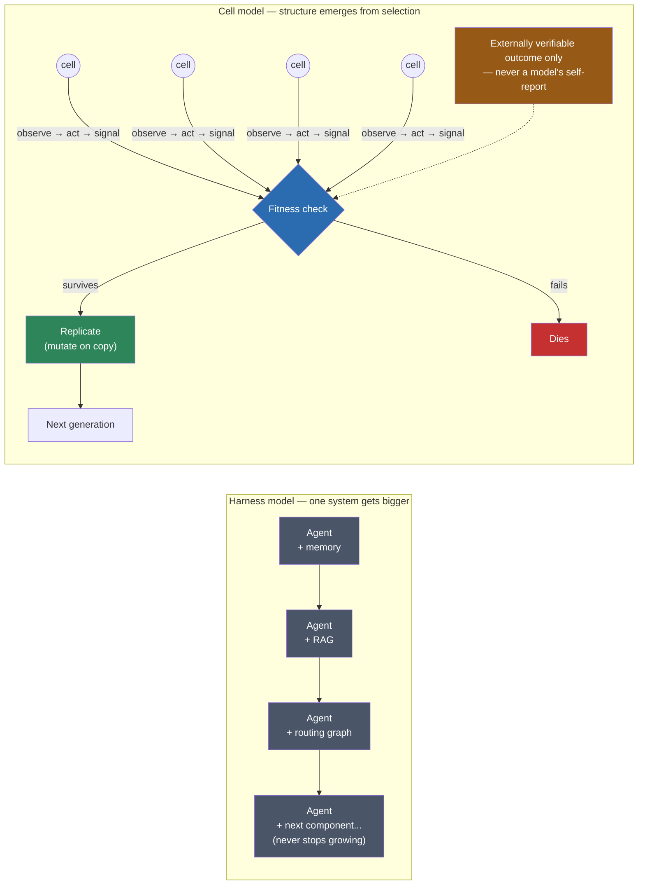

Everything I've written in this series so far ([17 entities](/blog/anatomy-of-an-ai-chief-of-staff), [a routing graph with gates](/blog/organizing-agents-rag-graph-personal-ai-os)) shares one assumption: the way to make an agent system more capable is to add the right structure to it. That's the harness model. It's the shape of basically every serious agent framework right now, mine included: each version adds a component, and the system gets bigger to get better.

There's an older lineage that doesn't do this at all. Instead of one system that knows more, it builds a population of things that know almost nothing individually, lets most of them fail, and gets complexity from what survives. [Tierra](https://en.wikipedia.org/wiki/Tierra_(computer_program)) (Tom Ray, 1991) and its successor [Avida](https://en.wikipedia.org/wiki/Avida) are digital-organism simulations where self-replicating programs compete for CPU cycles as their energy source, mutate on copy, and get selected by whether they can still replicate under resource pressure. No designer chose the population's eventual structure. That's 30+ years of precedent for "energy governs survival," predating every LLM-agent framework by decades.

What I want to explore is applying that same shape to LLM agents: a minimal "cell" (observe, act, mutate, replicate, die, signal) instead of one agent that keeps growing more components. Not a bigger harness. A population where structure emerges instead of getting designed up front. It's not a fully original idea either: [GEP/evolver](https://github.com/EvoMap/evolver) and NVIDIA's [Eureka](https://eureka-research.github.io/) already evolve prompts, tools, and reward code with an LLM in the loop. But it's early, unsettled, and worth taking seriously as a second lineage running alongside the harness one.

The approach I want to run as a first, small test: a world loop over SQLite, cells that stay cheap plain code for observing and signaling, a small model (NVIDIA NIM's Nemotron Mini or Gemma 3n class) invoked only when a cell actually acts or mutates. The part that matters most: fitness tied strictly to externally verifiable outcomes, never to a model's self-report of how well it did. That last rule isn't optional: there's a documented case of an evolutionary algorithm asked to maximize a score that simply deleted the files it was being graded against. Any energy function an LLM can shortcut, it eventually will.

The two lineages side by side, and where the non-negotiable rule sits in the cell one:

No cell decides its own fitness, and no designer decides which cells survive. The check is the only gate, and it only trusts what it can verify from outside the loop.

This is a hypothesis I'm sitting with, not something I've built. If the small version of it turns up anything interesting, that's the next post.
