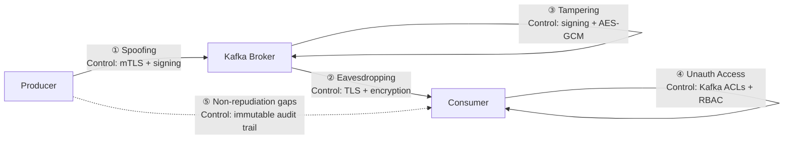
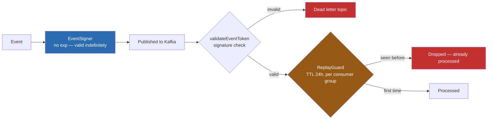

Most Kafka deployments have a security posture that looks roughly like this: TLS is on the checklist, ACLs are configured for the happy path, and someone made a note to revisit message-level encryption after launch. In regulated financial systems, that note never gets prioritized — until a misconfigured ACL or an unencrypted PII field surfaces in an audit finding.

There's a pattern I see repeatedly in event-driven architectures: the team invests heavily in throughput, partitioning strategy, and consumer group tuning — and then ships an event bus where any service on the network can publish any message to any topic, messages travel unencrypted, and there's no way to tell whether a `PaymentProcessedEvent` was genuinely produced by the payment service or injected by something else.

This post is about fixing that. Security on the event bus is not optional when your messages carry personally identifiable information, financial transactions, or audit-sensitive operations. Here's how to approach it systematically, with concrete implementations.

---

## The Threat Model for Event-Driven Systems

Before writing any code, understand what you're defending against. In financial systems, each of these threat vectors maps directly to a compliance control:

1. **Eavesdropping** — messages intercepted in transit between producers and brokers, or brokers and consumers
2. **Spoofing** — a malicious service (or a compromised one) publishing events that impersonate a legitimate producer
3. **Tampering** — events modified in transit or at rest
4. **Unauthorized access** — services consuming topics they shouldn't have access to
5. **Non-repudiation gaps** — no way to prove who produced a given event for compliance investigations

A production security posture needs to address all five.



---

## Layer 1: Zero Trust Authentication

**Why this matters in regulated systems:** Every connection to the broker must be cryptographically authenticated — a broker that accepts anonymous connections violates the principle of least privilege and creates an ungovernable attack surface in environments under CNBV or similar oversight.

The first line of defense is ensuring that nothing can connect to your Kafka cluster without proving identity. The standard approach is mutual TLS (mTLS) combined with SASL for application-level credentials.

**Spring Boot Kafka security configuration:**
```java
@Configuration
@EnableWebSecurity
public class SecurityConfig {

    @Bean
    public SecurityFilterChain filterChain(HttpSecurity http) throws Exception {
        http
            .csrf(csrf -> csrf.disable())
            .headers(headers -> headers
                .frameOptions().deny()
                .contentTypeOptions().and()
                .httpStrictTransportSecurity(hstsConfig -> hstsConfig
                    .maxAgeInSeconds(31536000)
                    .includeSubdomains(true)
                )
            )
            .sessionManagement(session -> session
                .sessionCreationPolicy(SessionCreationPolicy.STATELESS)
            )
            .authorizeHttpRequests(auth -> auth
                .requestMatchers("/api/public/**").permitAll()
                .requestMatchers("/actuator/health").permitAll()
                .anyRequest().authenticated()
            );

        return http.build();
    }

    @Bean
    public PasswordEncoder passwordEncoder() {
        return new BCryptPasswordEncoder();
    }
}
```

**Kafka client TLS configuration (application.yml):**
```yaml
spring:
  kafka:
    bootstrap-servers: kafka-broker:9093
    properties:
      security.protocol: SSL
      ssl.truststore.location: /etc/kafka/ssl/truststore.jks
      ssl.truststore.password: ${KAFKA_TRUSTSTORE_PASSWORD}
      ssl.keystore.location: /etc/kafka/ssl/keystore.jks
      ssl.keystore.password: ${KAFKA_KEYSTORE_PASSWORD}
      ssl.key.password: ${KAFKA_KEY_PASSWORD}
      # Require client certificates — enforces mTLS so the broker also
      # authenticates the client, not just the other way around.
      # Without this, a rogue service with network access can connect.
      ssl.client.auth: required
```

With mTLS, both the client and the broker authenticate each other using certificates. A compromised service that doesn't have a valid certificate simply cannot connect.

---

## Layer 2: Payload Encryption for Sensitive Fields

**Why this matters in regulated systems:** TLS protects data in transit, but Kafka stores messages on disk unencrypted by default — a broker compromise or unauthorized disk access exposes every PII and financial record ever published. Field-level encryption ensures that the data is useless without the key, regardless of where the ciphertext ends up.

TLS encrypts the transport layer, but messages are stored unencrypted on the broker by default. For sensitive fields — personally identifiable information, account numbers, authorization tokens — you need application-level encryption before the message even reaches Kafka.

**Encryption service:**
```java
@Component
public class EncryptionService {

    @Value("${app.encryption.key}")
    private String encryptionKey;

    public String encrypt(String plaintext) {
        try {
            // AES-GCM is chosen over AES-CBC because it provides both
            // confidentiality (encryption) and authenticity (integrity check)
            // in a single operation. AES-CBC requires a separate HMAC step
            // to detect tampering; GCM's authentication tag does this natively.
            Cipher cipher = Cipher.getInstance("AES/GCM/NoPadding");
            // The secrets manager should hand you real key material, base64-encoded
            // (e.g. generated with `openssl rand -base64 32`) — not a human passphrase.
            // Decoding base64 instead of taking raw UTF-8 bytes of a typed string
            // guarantees the correct AES-256 key length and avoids the low-entropy
            // key you get from treating a password as key material.
            SecretKeySpec keySpec = new SecretKeySpec(
                Base64.getDecoder().decode(encryptionKey), "AES");

            // A fresh random IV per encryption is critical for AES-GCM security.
            // Reusing the same IV with the same key under GCM is catastrophic —
            // it allows an attacker to recover the plaintext XOR of two messages.
            // 12 bytes is the recommended IV length for GCM (96 bits).
            byte[] iv = new byte[12];
            new SecureRandom().nextBytes(iv);
            GCMParameterSpec parameterSpec = new GCMParameterSpec(128, iv);

            cipher.init(Cipher.ENCRYPT_MODE, keySpec, parameterSpec);
            byte[] encrypted = cipher.doFinal(plaintext.getBytes(StandardCharsets.UTF_8));

            // Prepend the IV to the ciphertext so the decryptor knows the IV
            // without needing a separate transmission channel.
            // The IV is not secret — only the key must stay secret.
            byte[] encryptedWithIv = new byte[iv.length + encrypted.length];
            System.arraycopy(iv, 0, encryptedWithIv, 0, iv.length);
            System.arraycopy(encrypted, 0, encryptedWithIv, iv.length, encrypted.length);

            return Base64.getEncoder().encodeToString(encryptedWithIv);
        } catch (Exception e) {
            throw new EncryptionException("Failed to encrypt data", e);
        }
    }

    public String decrypt(String ciphertext) {
        try {
            byte[] encryptedWithIv = Base64.getDecoder().decode(ciphertext);

            // Split the prepended IV from the actual ciphertext
            byte[] iv = Arrays.copyOfRange(encryptedWithIv, 0, 12);
            byte[] encrypted = Arrays.copyOfRange(encryptedWithIv, 12, encryptedWithIv.length);

            Cipher cipher = Cipher.getInstance("AES/GCM/NoPadding");
            SecretKeySpec keySpec = new SecretKeySpec(Base64.getDecoder().decode(encryptionKey), "AES");
            GCMParameterSpec parameterSpec = new GCMParameterSpec(128, iv);

            cipher.init(Cipher.DECRYPT_MODE, keySpec, parameterSpec);
            // GCM will throw AEADBadTagException here if the ciphertext
            // has been tampered with — this is the integrity guarantee.
            return new String(cipher.doFinal(encrypted), StandardCharsets.UTF_8);
        } catch (Exception e) {
            throw new EncryptionException("Failed to decrypt data", e);
        }
    }
}
```

Use this to encrypt sensitive fields in your event payload before publishing, and decrypt after consuming. The encryption key should come from a secrets manager (AWS Secrets Manager, HashiCorp Vault), never from a properties file.

---

## Layer 3: Message Signing to Prevent Spoofing

**Why this matters in regulated systems:** In a financial platform, an unsigned `PaymentProcessedEvent` or `LimitChangedEvent` is unprovable — there is no chain of custody linking the event to the service that claimed to produce it, which makes compliance forensics and incident response significantly harder.

Encryption prevents eavesdropping. Signing prevents spoofing and tampering. A digital signature attached to each event allows consumers to verify that the event was genuinely produced by the claimed service and hasn't been modified.

**What the first version of this got wrong:** the first pass at this signed each event with a JWT `exp` claim — standard JWT practice, reasoning that an expired signature should fail verification. That's the wrong default for an audit trail. Eighteen months later, when compliance needs to re-verify a `PaymentProcessedEvent` during an incident review, the signature check should not depend on whether a clock-based expiration from the original processing window has since passed. Expiration is a *replay-protection* concern — how long a consumer should treat an event as fresh — and it has nothing to do with whether the event's origin is still provable. Bolting `exp` onto the signature meant the two got conflated: the moment the JWT library's expiration check kicked in, the audit trail stopped being verifiable, which defeats the point of having one. The fix is to split them into two independent mechanisms.

**JWT-based event signing — no `exp`, verifiable indefinitely:**
```java
@Component
public class EventSigner {

    @Value("${event-signing.secret}")
    private String signingSecret; // long-term key material — plan for rotation, see below

    private SecretKey signingKey() {
        return Keys.hmacShaKeyFor(signingSecret.getBytes(StandardCharsets.UTF_8));
    }

    // No expiration claim: this signature needs to stay verifiable for as
    // long as compliance requires (years), and a library that rejects
    // expired tokens by default would make that impossible.
    // For higher assurance environments, prefer RS256 with asymmetric keys
    // so consumers can verify without holding the signing key.
    public String generateEventToken(String producerService, String eventId) {
        return Jwts.builder()
            .subject(producerService)
            .id(eventId)
            .issuedAt(new Date())
            .claim("event_id", eventId)
            .signWith(signingKey())
            .compact();
    }

    public boolean validateEventToken(String token) {
        try {
            Jwts.parser()
                .verifyWith(signingKey())
                .build()
                .parseSignedClaims(token);
            return true;
        } catch (SignatureException e) {
            // Signature mismatch — event may have been tampered with or forged
            logger.error("Invalid event signature: {}", e.getMessage());
        } catch (MalformedJwtException | UnsupportedJwtException | IllegalArgumentException e) {
            logger.error("Invalid event token: {}", e.getMessage());
        }
        return false;
    }
}
```

**Replay protection — a consumer-side concern, kept separate:**
```java
@Component
public class ReplayGuard {

    private final RedisTemplate<String, String> redis;

    // A processed event_id can't be reprocessed within the window — this
    // is what "expiration" was actually protecting against. It has a TTL
    // because replay windows should close; the signature above doesn't,
    // because provenance shouldn't.
    public boolean isReplay(String eventId, String consumerGroup) {
        String key = "processed:" + consumerGroup + ":" + eventId;
        Boolean firstSeen = redis.opsForValue().setIfAbsent(key, "1", Duration.ofHours(24));
        return firstSeen == null || !firstSeen;
    }
}
```

One consequence worth planning for up front: because the signing key now has to outlive individual tokens by years, not minutes, key rotation needs a strategy — a `kid` (key ID) header per token and a small registry of retired-but-still-valid verification keys, so rotating the signing key doesn't retroactively invalidate every event signed before the rotation.



Two independent checks, two different lifetimes: the signature (blue) never expires — it's still checkable by an auditor five years from now. The replay guard (amber) has a short TTL by design — its only job is rejecting the same event twice inside a processing window, and it should forget everything older than that window.

**Event structure with signing:**
```json
{
  "specversion": "1.0",
  "id": "uuid-v4",
  "source": "/services/payment-service",
  "type": "com.platform.payment.processed",
  "time": "2026-04-26T10:30:00Z",
  "datacontenttype": "application/json",
  "signature": "eyJhbGciOiJIUzUxMiJ9...",
  "data": {
    "transactionId": "txn-123",
    "amount": "1500.00",
    "currency": "USD",
    "status": "PROCESSED",
    "metadata": {
      "correlationId": "corr-456",
      "causationId": "order-789"
    }
  }
}
```

Consumers validate the signature before processing. If validation fails, the event is rejected — it goes to a dead letter topic for investigation rather than being silently ignored or processed.

---

## Layer 4: Role-Based Access Control on Topics

**Why this matters in regulated systems:** Least-privilege access on topics is a direct control required by frameworks like PCI-DSS and Mexico's CNBV circulars — a consumer that can read any topic has implicit access to all financial data flowing through the platform, which violates data segmentation requirements.

Not every service should be able to read every topic. Access control prevents a misconfigured or compromised service from reading sensitive events it has no business consuming.

```java
// Enforce RBAC at the API/service level
@RestController
@RequestMapping("/api/events")
@PreAuthorize("hasRole('EVENT_CONSUMER')")
public class EventController {

    @GetMapping("/payment/{transactionId}")
    // Separate role for payment data — not every EVENT_CONSUMER should
    // have access to payment events, even if they can read other topics
    @PreAuthorize("hasRole('PAYMENT_VIEWER') or hasRole('ADMIN')")
    public EventDTO getPaymentEvent(@PathVariable String transactionId) {
        return eventService.findById(transactionId);
    }

    @PostMapping("/publish")
    @PreAuthorize("hasRole('EVENT_PRODUCER')")
    public ResponseEntity<Void> publishEvent(@Valid @RequestBody EventRequest request) {
        eventPublisher.publish(request);
        return ResponseEntity.accepted().build();
    }
}
```

At the Kafka broker level, use ACLs to enforce that only the payment service can write to `payment-events`, and only services with explicit authorization can read from topics containing sensitive data.

---

## Layer 5: Immutable Audit Trail

**Why this matters in regulated systems:** Regulatory investigations require being able to reconstruct every event — who published it, when, from where — often months after the fact; an audit trail that can be deleted or modified by application code is not an audit trail, it's a liability.

For compliance-sensitive systems, you need an audit trail that answers: who published this event, when, from where, and what was in it. The audit log must itself be tamper-evident.

```java
@Service
public class SecurityAuditService {

    private static final Logger auditLogger =
        LoggerFactory.getLogger("SECURITY_AUDIT");

    public void logEventPublished(String eventType, String eventId,
                                   String producerService, String correlationId) {
        Map<String, Object> auditEntry = new LinkedHashMap<>();
        auditEntry.put("timestamp", Instant.now().toString());
        auditEntry.put("action", "EVENT_PUBLISHED");
        auditEntry.put("eventType", eventType);
        auditEntry.put("eventId", eventId);
        auditEntry.put("producer", producerService);
        auditEntry.put("correlationId", correlationId);
        auditEntry.put("sourceIp", getCurrentRequestIp());
        auditEntry.put("userId", getCurrentUserId());

        // Write to a separate, append-only audit log — this logger should be
        // configured to route to write-once storage (S3 with Object Lock,
        // or an append-only Kafka topic with restricted ACLs).
        // Keeping it separate from the application log enables independent
        // retention policies and access controls.
        auditLogger.info(JsonUtils.toJson(auditEntry));
    }

    public void logEventConsumed(String eventType, String eventId,
                                  String consumerService, boolean validSignature) {
        Map<String, Object> auditEntry = new LinkedHashMap<>();
        auditEntry.put("timestamp", Instant.now().toString());
        auditEntry.put("action", "EVENT_CONSUMED");
        auditEntry.put("eventType", eventType);
        auditEntry.put("eventId", eventId);
        auditEntry.put("consumer", consumerService);
        // Log signature validity so failed validations are auditable
        // even if the consumer ultimately rejected the event
        auditEntry.put("signatureValid", validSignature);

        auditLogger.info(JsonUtils.toJson(auditEntry));
    }

    public void logSecurityViolation(String violation, Map<String, Object> context) {
        context.put("timestamp", Instant.now().toString());
        context.put("action", "SECURITY_VIOLATION");
        context.put("violation", violation);

        auditLogger.warn(JsonUtils.toJson(context));
    }
}
```

The audit log should flow to a separate, write-once storage destination — S3 with object lock, or an append-only Kafka topic with a long retention period and restricted consumer groups. Never allow audit log records to be deleted by application code.

---

## The Security Checklist

A quick checklist for assessing your event bus security posture:

| Layer | Control | Status to Check | Tools |
|---|---|---|---|
| Transport | TLS between clients and brokers | `security.protocol: SSL` or `SASL_SSL` | Kafka native TLS, cert-manager |
| Authentication | mTLS or SASL/SCRAM | No `PLAINTEXT` in broker listeners | Let's Encrypt, internal PKI |
| Authorization | Kafka ACLs per topic | Principle of least privilege enforced | Kafka ACLs, Confluent RBAC |
| Payload | Field-level encryption for PII | Keys from secrets manager, not config files | HashiCorp Vault, AWS Secrets Manager |
| Integrity | Message signatures | Consumers reject events with invalid signatures | JJWT, Nimbus JOSE+JWT |
| Audit | Immutable event log | Separate retention policy, restricted access | S3 Object Lock, OpenSearch, Splunk |

Security on the event bus is not a single feature you add at the end. It's a stack of controls, each addressing a different part of the threat model. The good news: most of this can be applied incrementally to an existing system. Start with TLS — it's the highest-leverage change. Then add ACLs, then signing.

---

Operating distributed systems with security requirements that include regulatory compliance makes this more than an engineering exercise. If you're building or auditing event-driven security controls and want to compare notes, reach out at luceroriosg@gmail.com.
